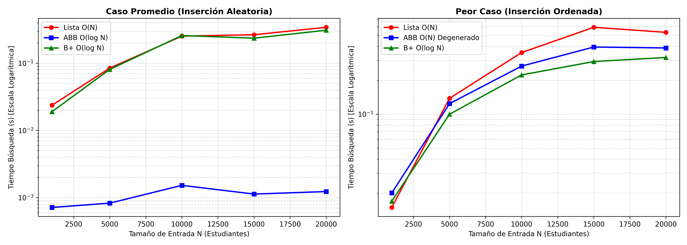
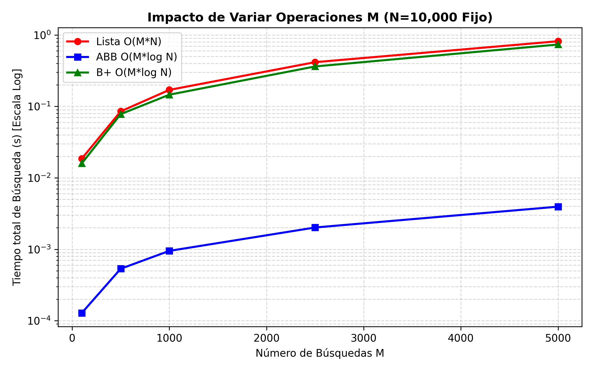

# Laboratorio 3: Análisis Comparativo de Rendimiento - Lista Secuencial vs. ABB vs. Árbol B+

**Estudiante:** Juan José Arango Figueroa  
**Materia:** Estructuras de Datos / Algoritmos  
**Institución:** Universidad de Antioquia  

## 1. Descripción del Proyecto

Este laboratorio implementa y evalúa tres estructuras de datos fundamentales para la gestión de registros de estudiantes identificados por un número de documento (ID):

1. **Lista Secuencial (list de Python):** Búsqueda lineal no indexada.
2. **Árbol Binario de Búsqueda (ABB):** Estructura jerárquica binaria no balanceada.
3. **Árbol B+:** Estructura multicamino auto-balanceada optimizada para búsquedas e índices.

El objetivo es analizar experimentalmente el impacto del tamaño de entrada (N), la cantidad de operaciones de búsqueda (M), y el orden de inserción (aleatorio vs. ordenado) en el tiempo de ejecución de las búsquedas.

## 2. Instrucciones de Ejecución

### Requisitos Previos
* Python 3.8 o superior.
* Librerías requeridas: matplotlib (`pip install matplotlib`)

### Pasos para Ejecutar
1. **Ejecutar el Banco de Pruebas Experimentales:**
   `python experimentos.py`
   *(Genera las mediciones numéricas y guarda los resultados en resultados.csv)*

2. **Generar las Gráficas Comparativas:**
   `python graficas.py`
   *(Lee resultados.csv y genera grafica_escalabilidad_N.png y grafica_variacion_M.png)*

## 3. Complejidad Algorítmica Teórica

* **Lista Secuencial:**
  * Inserción (Promedio / Peor Caso): O(1)
  * Búsqueda (Promedio / Peor Caso): O(N)

* **Árbol Binario de Búsqueda (ABB):**
  * Inserción (Promedio): O(log N) | Inserción (Peor Caso): O(N)
  * Búsqueda (Promedio): O(log N) | Búsqueda (Peor Caso): O(N)

* **Árbol B+:**
  * Inserción (Promedio / Peor Caso): O(log N)
  * Búsqueda (Promedio / Peor Caso): O(log N)

## 4. Análisis de Resultados y Gráficas

### 4.1. Impacto de la Variación de N (Escalabilidad)

* **Caso Promedio (Inserción Aleatoria):**
  * El **ABB** presenta el mejor desempeño en tiempo de búsqueda con una complejidad de O(log N), manteniéndose en el orden de milisegundos incluso para N = 20.000.
  * La **Lista Secuencial** escala de forma lineal O(N), aumentando su tiempo proporcionalmente al tamaño del conjunto de datos.
* **Peor Caso (Inserción Ordenada):**
  * Cuando los elementos ingresan de forma secuencial ordenada, el **ABB se degrada a una lista enlazada** de altura H = N, transformando su complejidad de búsqueda a O(N).
  * El **Árbol B+**, al mantener su propiedad de auto-balanceo mediante divisiones de nodos (splits), preserva una altura logarítmica H = O(log N) independientemente del orden de inserción.

### 4.2. Impacto de la Variación de M (Operaciones de Búsqueda)

* Para un valor fijo de N = 10.000, al incrementar el número de consultas M de 100 a 5.000:
  * La **Lista Secuencial** acumula un tiempo total de O(M * N).
  * El **ABB** mantiene una pendiente sustancialmente menor correspondiente a O(M * log N), demostrando la eficiencia de las estructuras jerárquicas para sistemas con alto volumen de lecturas.

  ## 5. Pequeña ayuda para mí

* **¿Por qué el ABB se degrada en la inserción ordenada?**
  * Porque cada nuevo elemento es mayor que el anterior, insertándose siempre como hijo derecho. Esto elimina la ramificación del árbol y genera una lista lineal de profundidad N, haciendo que la búsqueda pase de O(log N) a O(N).

* **¿Por qué el Árbol B+ evita esa degradación?**
  * El Árbol B+ es auto-balanceado. Cuando una hoja excede su capacidad máxima, el nodo se divide en dos y promociona la clave central hacia el padre, garantizando que todas las hojas permanezcan en el mismo nivel.

* **¿Por qué se utiliza escala logarítmica en el eje Y?**
  * Debido a la gran diferencia de magnitud entre los tiempos de O(log N) y O(N). En una escala lineal, las curvas de los árboles quedan pegadas al eje cero, impidiendo apreciar su comportamiento real.

* **¿Qué función cumplen la Media (mu) y la Desviación Estándar (sigma)?**
  * La **media** amortigua las variaciones temporales del procesador al promediar R repeticiones. La **desviación estándar** mide la estabilidad del experimento; un valor bajo asegura que los datos no sufrieron interferencia de procesos en segundo plano.